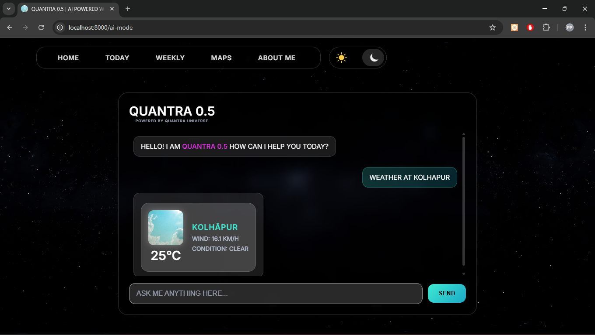
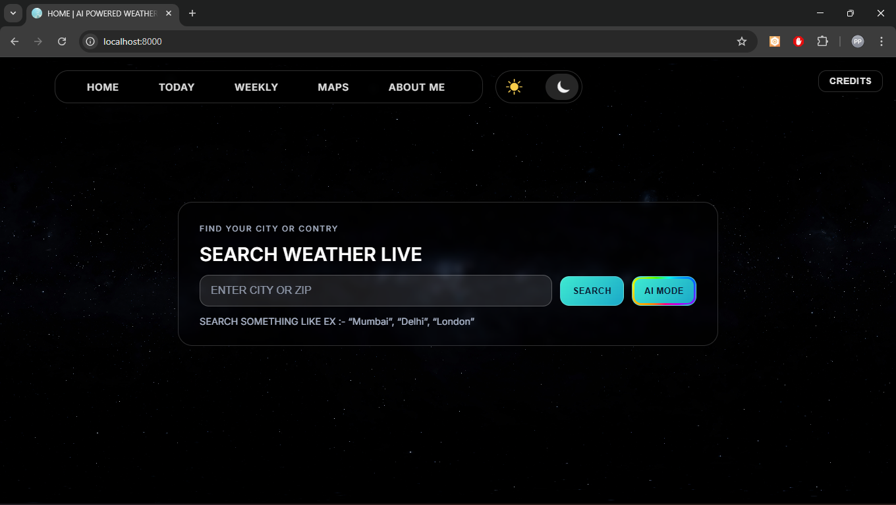
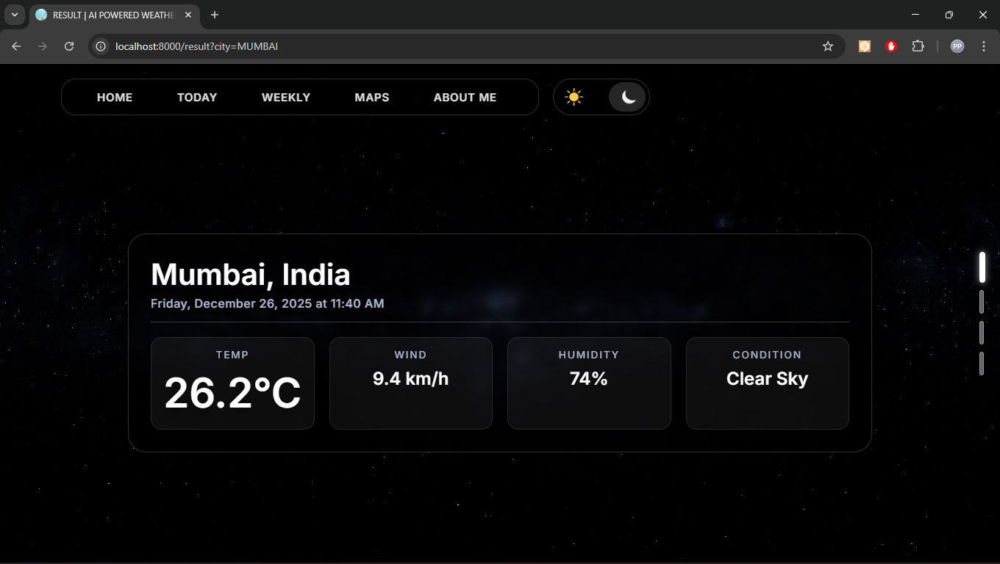
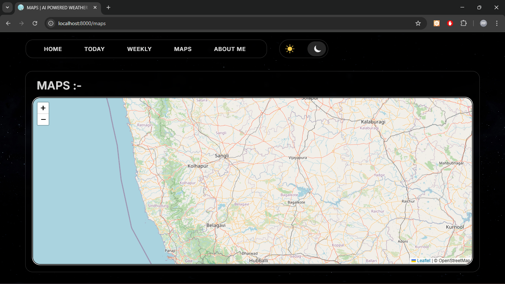
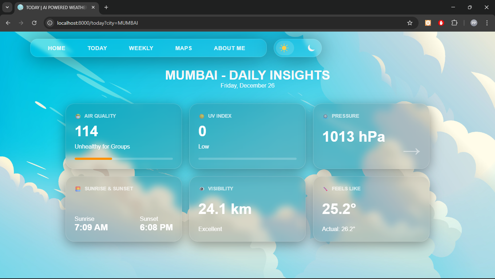
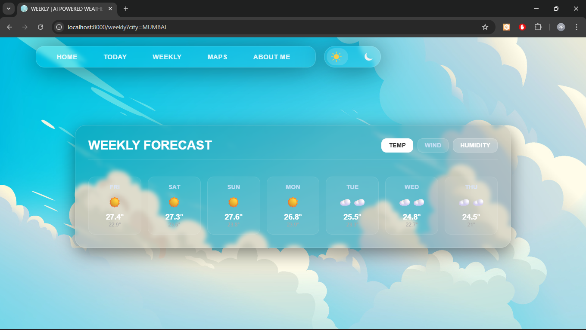
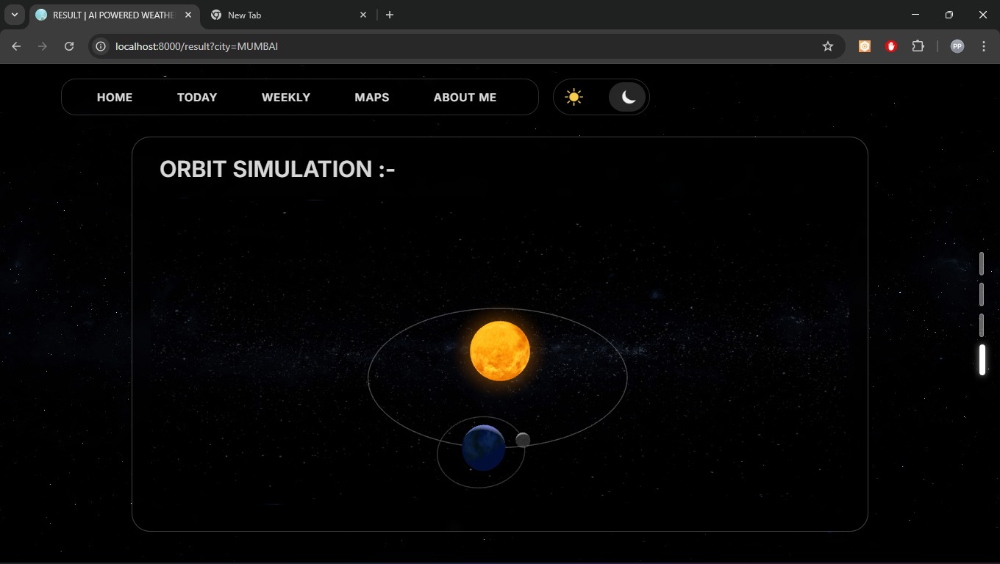
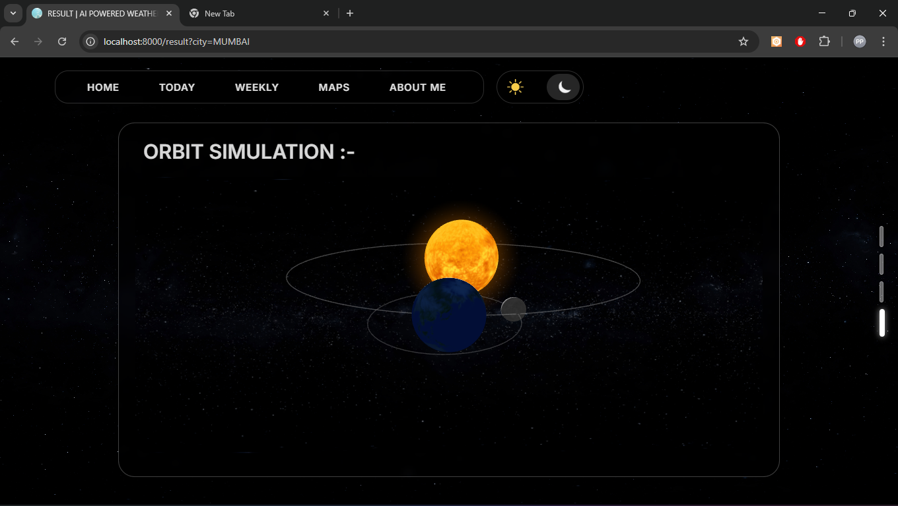

# 🌦️ AI-POWERED-WEATHER-WEB-APP

> **A SOLO FULL-STACK AI-POWERED WEATHER WEB APPLICATION FEATURING QUANTRA 0.5, REAL-TIME WEATHER DATA, INTELLIGENT CHAT ASSISTANCE, INTERACTIVE MAPS, AND ADVANCED FORECASTING VISUALIZATIONS.**


<div align="center">


</div>

---

## 📌 Project Overview

This project is a high-performance, feature-rich weather web application built as a **solo full-stack project**. It combines a modern, glassmorphism-inspired frontend with a robust **FastAPI** backend and a custom AI logic engine named **QUANTRA 0.5**.

Unlike standard weather apps, this system integrates **Conversational AI** directly into the user experience, allowing users to ask natural language questions about the weather, get lifestyle suggestions, and interact with a distinct AI personality.

---

## 🧠 QUANTRA 0.5 - The AI Core

**QUANTRA 0.5** is not just a wrapper around an LLM; it is a custom-designed AI architecture that powers the application's intelligence.

- **Custom Decision Engine**: Automatically determines if a user's query is weather-related, a lifestyle request, or general chat, routing it to the appropriate logic.
- **Context-Aware Weather Analysis**: Can interpret "What should I wear?" based on live weather data (Temperature, Condition, Wind) and generate smart outfit suggestions.
- **Personality Layer**: Features a strict but helpful persona ("....'s Assistant") that adds character to the interaction.
- **Powered by Gemini**: Utilizes Google's Gemini 2.0/2.5 Flash models for high-speed natural language processing.



---

## 🛠️ Tech Stack & Architecture

### Backend (Python & FastAPI)

The core of the application is built on **FastAPI**, chosen for its speed and asynchronous capabilities.

- **API Routing**: Handles all static file serving and API endpoints (`/query`, `/weather`).
- **Middleware**: Configured with CORS for seamless frontend communication.
- **Modular Design**: Separated into `decision_model.py`, `ai_brain.py`, and `weather_engine.py` for maintainability.

### Frontend

- **HTML5 / CSS3**: Custom "Glassmorphism" design with responsive layouts.
- **JavaScript (Vanilla)**: Handles dynamic DOM manipulation, API calls, and UI state.
- **Leaflet.js**: Renders interactive, city-centered maps.

### APIs

- **Open-Meteo**: Provides accurate, real-time weather data without API keys.
- **Google Gemini API**: Powers the conversational capabilities of QUANTRA 0.5.

---

## 📸 visual Tour

### 🏠 Home Page

A clean, mode-centric landing page offering both simple search and AI interaction.

|                Light Mode                 |                Dark Mode                |
| :---------------------------------------: | :-------------------------------------: |
|  |  |

### 📊 Detailed Weather Results

Comprehensive weather data including real-time metrics, solar/lunar simulations, and map visualization.

|          Hourly Forecast           |       Interactive Map       |
| :--------------------------------: | :-------------------------: |
|  |  |

### 📅 Advanced Forecasting

Dedicated views for Daily and Weekly breakdowns.

|         Today's Details         |          Weekly Forecast          |
| :-----------------------------: | :-------------------------------: |
|  |  |

### 🚀 SOLAR SIMULATION 

Representing real-time possitions of Earth and Moon using THREE.js

|         Solar simulation 1      |          Solar Simulation 2       |
| :-----------------------------: | :-------------------------------: |
|   |    |

---

## 🚀 Installation & Setup

Follow these steps to run the application locally on your machine.

### 1. Prerequisites

- **Python 3.9+** installed.
- A **Google Gemini API Key** (Get one from [Google AI Studio](https://aistudio.google.com/)).

### 2. Clone the Repository

```bash
git clone https://github.com/PARTTTHH/AI-POWERED-WEATHER-WEB-APP.git
cd AI-POWERED-WEATHER-WEB-APP
```

### 3. Install Dependencies

Install the required Python packages using the provided `requirements.txt`.

```bash
pip install -r requirements.txt
```

### 4. Configure Environment Variables

Create a `.env` file in the root directory (or inside `QUANTRA 0.5/` depending on your run context, but usually root is best practice for standard setups, though the code checks system env vars).

```env
GEMINI_API_KEY=your_api_key_here
```

### 5. Run the Application

Start the FastAPI server.

```bash
python "QUANTRA 0.5/main.py"
```

_Alternatively, if you have uvicorn installed globally:_

```bash
cd "QUANTRA 0.5"
uvicorn main:app --reload
```

### 6. Access the App

Open your browser and navigate to:

```
http://127.0.0.1:8000
```

---

## 🗂️ Project Structure

```plaintext
AI-POWERED-WEATHER-WEB-APP/
│
├── HOME/                   # Landing Page
├── RESULT/                 # Weather Results & Logic
├── TODAY/                  # Daily Detail View
├── WEEKLY/                 # 7-Day Forecast View
├── MAP/                    # Map Visualizations
├── ABOUT/                  # Developer Info
├── CREADITS/               # Attributions
├── QUANTRA 0.5/            # AI & Backend Core
│   ├── ai_mode.html / ai_mode.css   # AI Front-end Part
│   ├── main.py             # FastAPI App Entry Point
│   ├── ai_brain.py         # Gemini Integration
│   ├── decision_model.py   # Query Routing Logic
│   └── weather_engine.py   # Weather API Wrapper
├── SCREENSHOTS/            # Project Images
├── requirements.txt        # Python Dependencies
└── README.md               # Documentation
```

---

## 🔮 Future Enhancements

- [ ] Voice-based AI interaction
- [ ] User accounts and weather history
- [ ] Advanced forecast analytics
- [ ] Desktop application version

---

## 👨‍💻 Developer

**PARTH PUNGAONKAR**
_BCA Student | Full-Stack & AI/ML_

> This project reflects a strong focus on real-world application design, AI integration, and clean architecture, built entirely as a solo project.

---

### ⭐ Final Note

If you found this project interesting, feel free to ⭐ the repository!
